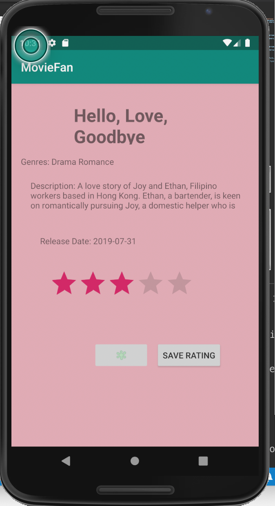
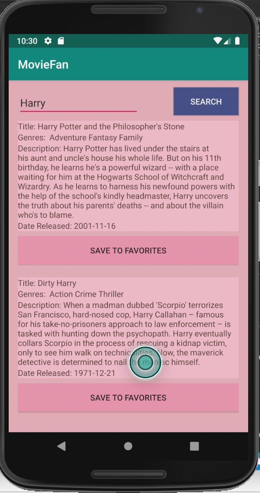
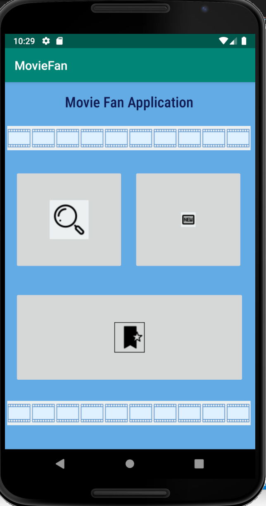

# Project Description
This application is for movie fans who want to browse new movies, search for movies and save favorites with their own ratings
## Getting Started
Clone this project on to your own machine
All of the tokens and authorization you would need is provided in the project
You can search for movies as well as look at new movies and add them to favorites
To view and rate movie perform a long click on the title of the movies from the view favorites screen

## Testing
There are instrumented tests that can be ran all at once by running the whole test file or individually

Here is a link to the api used for the movies
https://www.themoviedb.org/settings/api
Here is a link to the rest api
https://github.com/tonyspicervovin/movie_rest_api

## Author
Anthony Covin
https://github.com/tonyspicervovin

Icons from
https://icons8.com/

 
 
 

